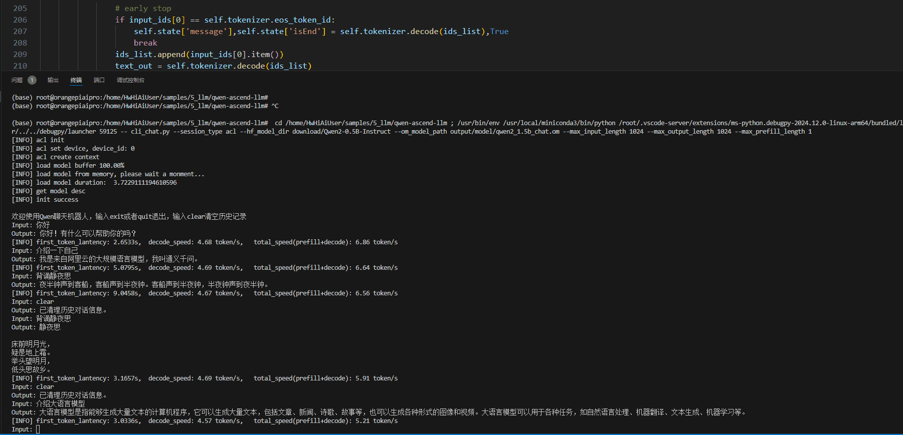
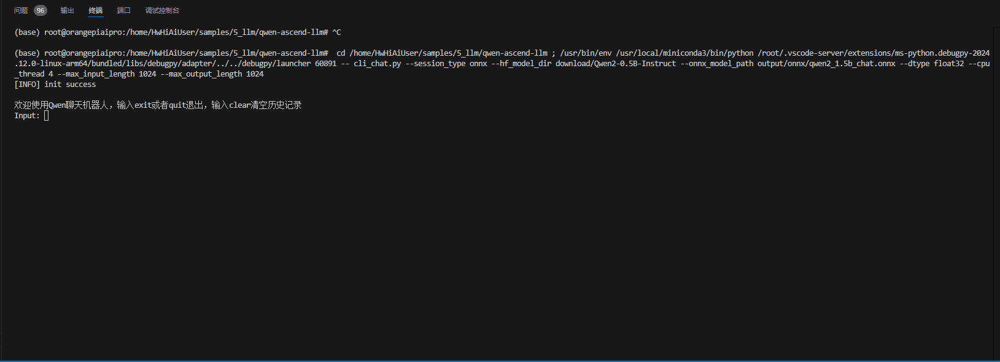

## qwen2在Ascend310B4上的评测


## 依赖
- 香橙派AIPRO：http://www.orangepi.cn/html/hardWare/computerAndMicrocontrollers/details/Orange-Pi-AIpro.html
- CANN8.0（自己手动安装的，参考：https://www.hiascend.com/forum/thread-0295148017012941005-1-1.html）
- 64GB内存卡（最好是更大，不然几个模型就满载了）
- 其他一些疑问可参考[原始项目readme](https://github.com/Tlntin/qwen-ascend-llm)
- kv_cache_length改为1024了


## Ascend npu推理
npu推理采用ACL调用npu，float16的npu模型会比float32的onnx模型会更快。[npu模型下载](https://pan.baidu.com/s/1pPs5zKnS8ebdkUk4PnsE5A?pwd=mbbq), 提取码: mbbq 



## onnx推理
onnx推理采用onnxruntime作为推理引擎。onnxruntime采用float32推理会比float16更快（原因未知）。修改node之后的float16 [onnx模型下载连接](https://pan.baidu.com/s/1pPs5zKnS8ebdkUk4PnsE5A?pwd=mbbq) 提取码: mbbq 



## 注意
- 最初的onnx需要导出为float16，如果导出为float32会有问题。onnx float32，"--precision_mode=must_keep_origin_dtype", "--precision_mode_v2=origin",都试过，转换出来的om文件推理都不正确。
```
欢迎使用Qwen聊天机器人，输入exit或者quit退出，输入clear清空历史记录
Input: hello
Output: 日起草一份周恩爱证罪数集除公共舞台是时候会显示界面会报错乘集选二取二二三丿同义警告示板卡。为人民服务是
```


## 其他
1.因为要用kvcache，看起来用python来进行部署会更快，后续尝试c++的部署方式，看速度是否更快